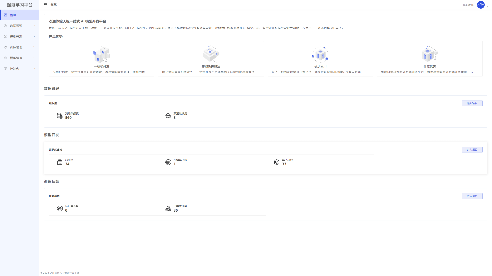
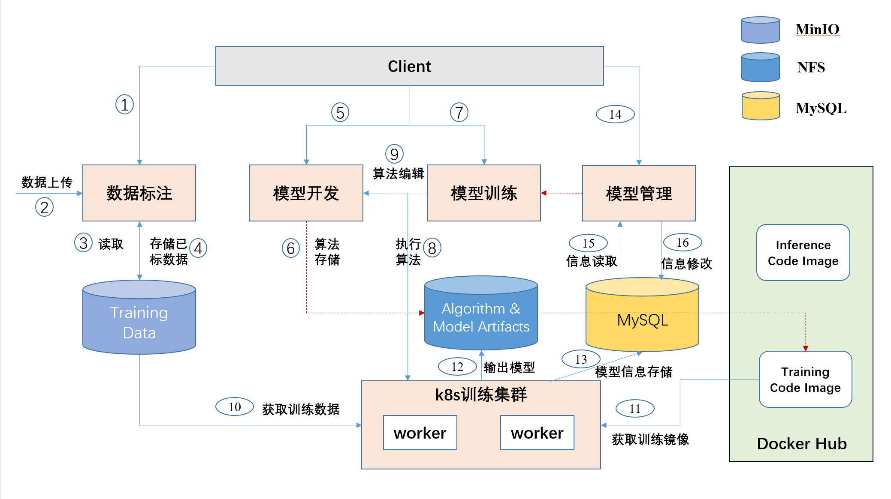

<p align="center">
  <a href="http://tianshu.org.cn">
    
  </a>
</p>

<h1 align="center">天枢一站式AI模型开发平台</h1>

**天枢人工智能开源开放平台**（简称：**天枢平台**）是天枢平台由之江实验室牵头，联合北京一流科技、中国信通院和浙江大学共同自研的人工智能开源平台。整个平台由一站式AI模型开发平台、高性能深度学习框架和模型炼知框架三大子系统组成。

其中， **一站式AI模型开发平台面**（简称：**一站式开发平台**）面向AI模型生产的生命周期，提供了包括数据处理、模型开发、模型训练和模型管理等功能，方便用户一站式构建AI算法。

## 平台优势

* **一站式开发**：为用户提供一站式深度学习开发功能，通过智能数据处理、便利的模型开发和模型训练，打通深度学习全链路；

* **集成先进算法**：除了囊括常规AI算法外，之江天枢还集成了多领域的独家算法，提供业界领先性能。

* **灵活易用**：除了一站式深度学习开发平台，亦提供可视化和动静结合编码方式，调试灵活，小白亦可快速上手。

* **性能优越**：集成自主研发的分布式训练平台，提供高性能的分布式计算体验，节省训练成本和训练时间。

## 页面预览



## 目录结构
```
├── dubhe_data_process            数据处理服务
├── dubhe-server                  后端服务 
├── dubhe-visual-server           可视化服务 
├── webapp                        前端服务 
├── dataset-util                  数据集上传脚本服务
├── distribute-train-operator     分布式训练OP服务
```

## 技术架构


## 反馈问题

- [在线社区](http://www.aiiaos.cn/index.php?s=/forum/index/forum/id/45.html)
- 钉钉交流群


## 许可证书
本项目的发布受[Apache 2.0 license](./LICENSE)许可认证。
