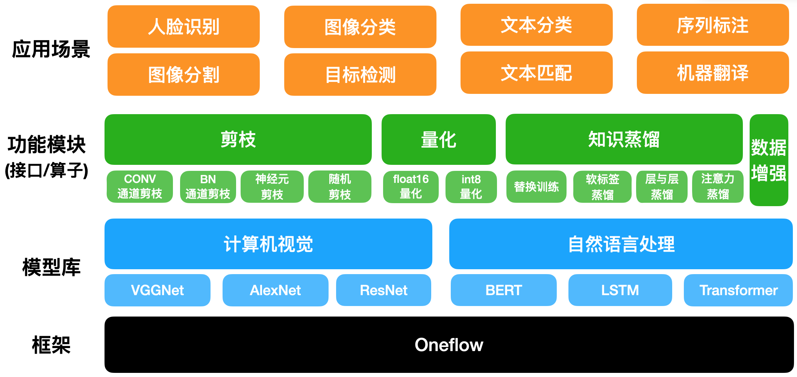

# Oneflow-Model-Compression

## 概述
炼知技术平台是一个模型压缩平台，包含剪枝、量化、知识蒸馏等一系列模型压缩策略。
提供完整的模型压缩解决方案，可用于各种类型的自然语言和计算机视觉场景，如文本分类、推理，图像分类等。
另外，平台在不断完善各种压缩策略在经典开源任务的Benchmark，以便用户参考。
同时，平台也提供各种压缩策略的功能算子，方便用户使用、复现最新的论文方法，以及利用压缩算子进行二次开发。

     
    
     

## 功能

<table style="width:100%;" cellpadding="2" cellspacing="0" border="1" bordercolor="#000000">
	<tbody>
		<tr>
			<td style="text-align:center;">
				功能模块
			</td>
			<td style="text-align:center;">
				算法
			</td>
			<td style="text-align:center;">
				相关文档
			</td>
		</tr>
		<tr>
			<td style="text-align:center;">
				量化
			</td>
			<td>
				<ul>
					<li>
                        deep compression:&nbsp;<a href="https://arxiv.org/pdf/1510.00149.pdf" target="_blank">Han S, Mao H, Dally W J. "Deep compression: Compressing deep neural networks with pruning, trained quantization and huffman coding"&nbsp;<i>arXiv preprint arXiv:1510.00149</i>&nbsp;(2017).</a>
					</li>
					<li>
                        NVIDIA TensorRT:&nbsp;<a href="https://github.com/NVIDIA/TensorRT" target="_blank">a C++ library for high performance inference on NVIDIA GPUs and deep learning accelerators.&nbsp;<i></i>&nbsp;</a>
					</li>					
				</ul>
			</td>
			<td>
				<ul>
					<li>
						<a href="./docs/API_quant.md" target="_blank">量化API文档</a>
					</li>
				</ul>
			</td>
		</tr>
		<tr>
			<td style="text-align:center;">
				剪枝 
			</td>
			<td>
				<ul>
					<li>
                        bn channel slimming:&nbsp;<a href="https://arxiv.org/abs/1708.06519" target="_blank">Zhuang Liu, Jianguo Li, Zhiqiang Shen. "Learning Efficient Convolutional Networks through Network Slimming"&nbsp;<i>arXiv preprint arXiv:1708.06519</i>&nbsp;(2017).</a>
					</li>
                    <li>
                        conv channel slimming:&nbsp;<a href="https://arxiv.org/abs/1608.08710" target="_blank">Hao Li, Asim Kadav, Igor Durdanovic. "Pruning Filters for Efficient ConvNets"&nbsp;<i>arXiv preprint arXiv:1608.08710</i>&nbsp;(2016).</a>
					</li>
                    <li>
                        conv channel slimming:&nbsp;<a href="http://cn.arxiv.org/abs/1607.03250" target="_blank">Hengyuan Hu, Rui Peng, Yu-Wing Tai. "Network Trimming: A Data-Driven Neuron Pruning Approach towards Efficient Deep Architectures"&nbsp;<i>arXiv preprint arXiv:1607.03250</i>&nbsp;(2016).</a>
					</li>
				</ul>
			</td>
			<td>
					<ul>
						<li>
							<a href="./docs/API_prune.md" target="_blank">剪枝API文档</a>
						</li>
					</ul>
					<ul>
						<li>
							<a href="./model_compress/ChannelSlimming" target="_blank">剪枝快速上手</a>
						</li>
					</ul>
			</td>
		</tr>
		<tr>
			<td style="text-align:center;">
				知识蒸馏
			</td>
			<td>
				<ul>
					<li>
						Knowledge Distillation:&nbsp;<a href="https://arxiv.org/abs/1503.02531" target="_blank">Hinton, Geoffrey, Oriol Vinyals, and Jeff Dean. "Distilling the knowledge in a neural network."&nbsp;<i>arXiv preprint arXiv:1503.02531</i>&nbsp;(2015).</a>
					</li>
					<li>
						Distilled-BiLSTM:&nbsp;&nbsp;<a href="https://arxiv.org/abs/1903.12136" target="_blank">Tang, Raphael, et al. "Distilling task-specific knowledge from bert into simple neural networks." arXiv preprint arXiv:1903.12136 (2019).</a>
					</li>
					<li>
						BERT-PKD:&nbsp;&nbsp;<a href="https://arxiv.org/abs/1908.09355" target="_blank">Sun, Siqi, et al. "Patient knowledge distillation for bert model compression." arXiv preprint arXiv:1908.09355 (2019).</a>
					</li>
					<li>
						TinyBERT: <a href="https://arxiv.org/abs/1909.10351" target="_blank">Jiao, Xiaoqi, et al. "Tinybert: Distilling bert for natural language understanding." arXiv preprint arXiv:1909.10351 (2019).</a>
					</li>
					<li>
						MobileBERT: <a href="https://arxiv.org/abs/2004.02984" target="_blank">Sun, Zhiqing, et al. "Mobilebert: a compact task-agnostic bert for resource-limited devices." arXiv preprint arXiv:2004.02984 (2020).</a>
					</li>
					<li>
						BERT-Theseus: <a href="https://arxiv.org/abs/2002.02925" target="_blank">Xu, Canwen, et al. "Bert-of-theseus: Compressing bert by progressive module replacing." arXiv preprint arXiv:2002.02925 (2020).</a>
					</li>
					<li>
						改进版的BERT-Theseus: <a href="https://arxiv.org/abs/2002.02925" target="_blank">Xu, Canwen, et al. "Bert-of-theseus: Compressing bert by progressive module replacing." arXiv preprint arXiv:2002.02925 (2020).</a>
					</li>
				</ul>
			</td>
			<td>
				<ul>
					<li>
						<a href="./docs/API_knowledge_distill.md" target="_blank">知识蒸馏API文档</a>
					</li>
					<li>
					    <a href="./model_compress/distil" target="_blank">知识蒸馏快速上手</a>
                   </li>
                   <li>
					    <a href="./model_compress/distil/examples/knowledge_distillation/README.md" target="_blank">Knowledge Distillation算法文档</a>
                    </li>
                    <li>
					    <a href="./model_compress/distil/examples/distilled-bilstm/README.md" target="_blank">Distilled-BiLSTM算法文档</a>
                    </li>
                    <li>
					    <a href="./model_compress/distil/examples/bert-pkd/README.md" target="_blank">BERT-PKD算法文档</a>
                    </li>
                    <li>
					    <a href="./model_compress/distil/examples/tinybert/README.md" target="_blank">TinyBERT算法文档</a>
                    </li>
                    <li>
					    <a href="model_compress/distil/theseus/README.md" target="_blank">BERT-Theseus算法文档</a>
					</li>
				</ul>
			</td>
		</tr>
	</tbody>
</table>>

 

## 使用
- Oneflow介绍： 深度学习框架Oneflow[介绍以及环境安装说明](https://github.com/Oneflow-Inc/oneflow)。
- Oneflow快速开始：通过[简单示例](http://docs.oneflow.org/quick_start/quickstart_in_3_min.html)介绍如何快速3分钟上手使用Oneflow。
- 模型压缩API文档：用户接口文档，包含以下功能
    - [量化](./docs/API_quant.md)
    - [剪枝](./docs/API_prune.md)
    - [知识蒸馏](./docs/API_knowledge_distill.md)
- 高阶教程：包括在CV和NLP等应用场景任务的使用示例、算法使用步骤，高级特性的使用教程。
    - 量化功能文档: 介绍量化功能使用示例，主要包含int8量化。
    - 剪枝功能文档:  介绍通道剪枝实现和[使用示例](./model_compress/ChannelSlimming/readme.md)，只要包括CNN模型、DNN模型的不同剪枝算子。
    - [知识蒸馏功能](./model_compress/distil)文档: 介绍知识蒸馏功能相关论文实现和使用示例，主要包含[KD](./model_compress/distil/examples/knowledge_distillation/README.md), [Distilled-BiLSTM](./model_compress/distil/examples/distilled-bilstm/README.md), [BERT-PKD](./model_compress/distil/examples/bert-pkd/README.md), [TinyBERT](./model_compress/distil/examples/tinybert/README.md), [BERT-Theseus](model_compress/distil/theseus/README.md)等算法。
    - [TensorRT量化部署](./docs/API_quant.md): 介绍如何使用TensorRT部署量化得到的Oneflow模型。
- [模型库](./docs/model_zoo.md)：各个压缩算法在文本分类、推理，图像分类等数据集上的实验结果，包括模型精度、模型尺寸和推理速度。
